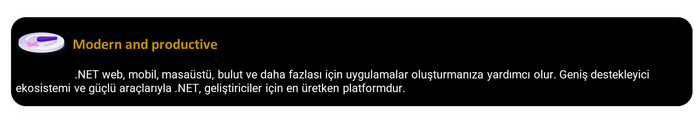

  

<h3 align="center">Dotnet Aspnet Core Web Application Learning</h3>

---

 Aspnet Core 7.0 Full Content
      

## ✓ Table of Contents

- [About](#about)
- [Getting Started](#getting_started)
- [Usage](#usage)
- [Built Using](#built_using)
- [Authors](#authors)
- [Acknowledgments](#acknowledgement)

## ≈ About 

ASP.NET Core, modern, bulut özellikli, İnternet'e bağlı uygulamalar oluşturmaya yönelik platformlar arası, yüksek performanslı, açık kaynak bir çerçevedir.

> dotnet :

## ∞ Getting Started 

Aspnet Core ile modern web uygulamaları geliştirirek aşağıdaki konuları tamamlayarak yüksek performanslı bir şekilde kullanabilirsiniz;
1. **Best Practices**
    - [ ] N-Layer Architecture
        - [ ] Core Layer
        - [ ] Repository Layer
        - [ ] Service Layer
        - [ ] Web API Layer 
        - [ ] Web View Layer
2. **Web API**
    - [ ] [API](./docs/webapi.md)
    - [ ] Dependeny Injection (Built-in IoC, )  
    - [ ] Middleware
    - [ ] Configuration
    - [ ] Options
    - [ ] Enviroments
    - [ ] Routing
    - [ ] Http Methods
    - [ ] Http Status Code
    - [ ] Http Header
    - [ ] CORS (Cross Origin Resource Request)
    - [ ] Versioning
    - [ ] Security
    - [ ] Fluent Validation
    - [ ] Nlogger
    - [ ] Automapper 
    - [ ] Global Exception
    - [ ] Filters

3. **Web Uygulamaları - Asp.Net Core MVC ile geliştirmeler yapılacaktır.**
    - [ ] Routing
    - [ ] Static Files
    - [ ] MVC Introduction
    - [ ] View - Partial View
    - [ ] Controller
    - [ ] State Management
    - [ ] Layout - ViewImport - ViewStart - GlobalUsing
    - [ ] Razor syntax
    - [ ] Tag Helpers
    - [ ] App Parts
    - [ ] App Model
    - [ ] Area
    - [ ] View Components
3. **Minimum API**
4. **Security and Identity**
5. **ORM Tools (Entity Framework - Dapper - NHirbernate)**
6. **Test Etme, Hata Ayıklama** 
7. **Performans**
8. **Genelleştirme ve Yerelleştirme**
9. **Gerçek Zamanlı Uygulamalar**
10. **gPRC**
11. **Blazor**
12. **Advanted**
12. **Publish**

## 🎈 Usage 

Visual Studio 2022 indirip ASP.Net Core seçeneğini seçerek kurmanız durumunda stabil dotnet versiyonu ile kurulum tamamlanır.

## ⛏️ Built Using 

- [.NET](https://dotnet.microsoft.com/en-us/download) - .NET ve ASP.NET Core için çalışma zamanları, SDK'lar ve geliştirici paketleri.
- [Visual Studio 2022](https://visualstudio.microsoft.com/downloads/) - .NET geliştiricileri için en kapsamlı IDE
- [SQL Server 2019](https://www.microsoft.com/en-us/sql-server/sql-server-downloads) - MS SQL Server
- [Git](https://git-scm.com/downloads) - Version Kontrol Sistemi
- [Postman](https://git-scm.com/downloads) - API yaşam döngüsünün her adımını basitleştirir ve API'leri daha hızlı oluşturabilmenizi sağlar.

## ✍️ Authors 

- [@huseyinocak](https://github.com/huseyinocak) - Idea & Initial work

See also the list of [contributors](https://github.com/kylelobo/The-Documentation-Compendium/contributors) who participated in this project.

## 🎉 Acknowledgements 

- Thanks to everyone who followed and benefited.
